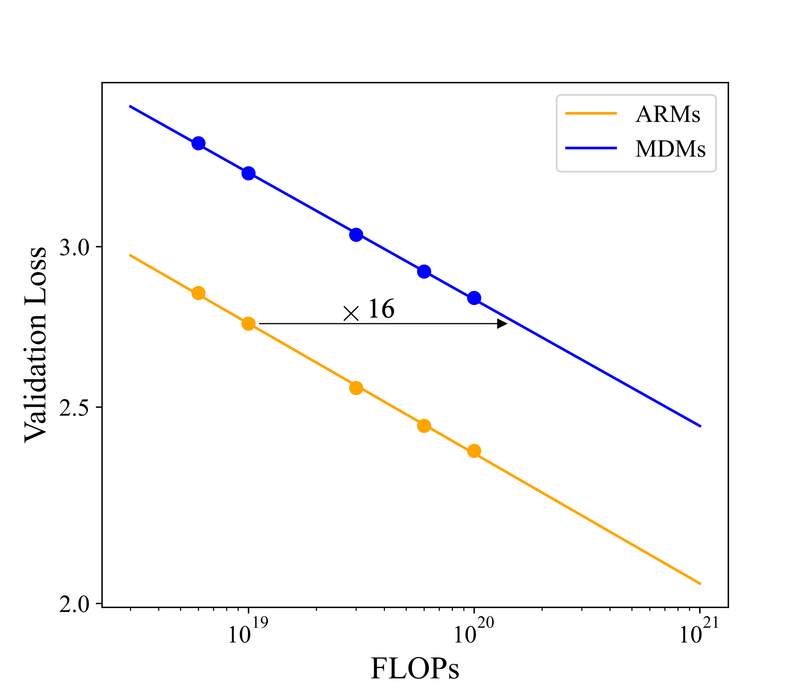
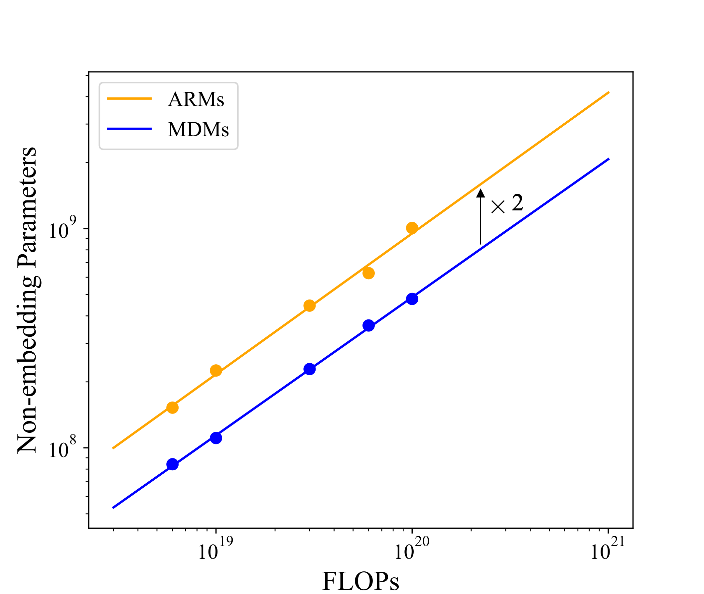

# Scaling up Masked Diffusion Models on Text

[](https://arxiv.org/abs/2410.18514)
[](https://huggingface.co/nieshen/SMDM)

Masked diffusion models (MDMs) have shown promise in language modeling, yet their scalability and effectiveness in core 
language tasks, such as text generation and language understanding, remain underexplored. This paper establishes the 
first scaling law for MDMs, demonstrating a scaling rate comparable to autoregressive models (ARMs) and a relatively 
small compute gap. Motivated by their scalability, we train a family of MDMs with up to 1.1 billion (B) parameters to 
systematically evaluate their performance against ARMs of comparable or larger sizes. Fully leveraging the probabilistic 
formulation of MDMs, we propose a simple yet effective *unsupervised classifier-free* guidance that effectively 
exploits large-scale unpaired data, boosting performance for conditional inference. In language understanding, the 
1.1B MDM outperforms the 1.1B TinyLlama model trained on the same data across four of eight zero-shot benchmarks. 
Notably, it achieves competitive math reasoning ability with the 7B Llama-2 model on the GSM8K dataset. In text 
generation, MDMs provide a flexible trade-off compared to ARMs utilizing KV-cache: MDMs match the performance of 
ARMs while being 1.4 times faster or achieving higher quality than ARMs at a higher computational cost. Moreover, 
MDMs address challenging tasks for ARMs by effectively handling bidirectional reasoning and adapting to temporal 
shifts in data. Notably, a 1.1B MDM breaks the *reverse curse* encountered by much larger ARMs with significantly 
more data and computation, such as 13B Llama-2 and 175B GPT-3.


<div style="display: flex; justify-content: center; flex-wrap: wrap;">
    
    
</div>


## Dependency
We can build the Anaconda environment based on [TinyLlama](https://github.com/jzhang38/TinyLlama/blob/main/PRETRAIN.md). First install the [TinyLlama](https://github.com/jzhang38/TinyLlama/blob/main/PRETRAIN.md) Anaconda environment and then run
```sh
pip install lm-eval==0.4.4 numpy==1.25.0 bitsandbytes==0.43.1
pip install openai==0.28 fschat==0.2.34 anthropic
```
In addition, we provide the conda installation commands in the [CONDA.md](CONDA.md) file for reference and completeness.

## Pretrained models
We provided all pretrained models on [Huggingface](https://huggingface.co/nieshen/SMDM), including those 
for the scaling laws experiment, the conditional generation experiment, 
and the reverse curse experiment. 

We hope that the series of pretrained ARMs and MDMs will contribute to the advancement of the field.


## Pretrain
Please first use the code provided by [TinyLlama](https://github.com/jzhang38/TinyLlama/blob/main/PRETRAIN.md) to preprocess the 
[SlimPajama](https://huggingface.co/datasets/cerebras/SlimPajama-627B) dataset and the put the data chunks into `/dataset/slim_star_combined`.


### Pretrain ARMs
```sh
# e.g., 1028M non-embedding parameters ARM and 100e18 training FLOPs, 8 GPUs
lightning run model \
    --node-rank=0  \
    --accelerator=cuda \
    --devices=8 \
    --num-nodes=1 \
    pretrain/train_ar.py --model 1028 --flops 100.
```


### Pretrain MDMs
```sh
# e.g., 170M non-embedding parameters MDM and 10e18 training FLOPs, 8 GPUs
lightning run model \
    --node-rank=0  \
    --accelerator=cuda \
    --devices=8 \
    --num-nodes=1 \
    pretrain/train_mdm.py --model 170 --flops 10.
```


### Pretrain MDMs with stochastic sequence length
```sh
# e.g., 170M non-embedding parameters MDM and 60e18 training FLOPs, 8 GPUs
# set 1% data to a stochastic sequence length
lightning run model \
    --node-rank=0  \
    --accelerator=cuda \
    --devices=8 \
    --num-nodes=1 \
    pretrain/train_mdm_rl.py --model 170 --flops 60. --ssl_ratio 0.01
```

### Multi-machine training
```sh
# e.g., 1028M non-embedding parameters MDM and 1600e18 training FLOPs
# set 1% data to a stochastic sequence length
# 2 machines, 16 GPUs
lightning run model \
    --node-rank=$RANK  \
    --main-address=$MASTER_ADDR \
    --accelerator=cuda \
    --devices=8 \
    --num-nodes=2 \
    pretrain/train_mdm_rl.py --model 1028 --flops 1600. --ssl_ratio 0.01 --nodes_num 2
```

## Supervised fine-tuning
### Math reasoning
Please download the augmented training [data](https://github.com/da03/implicit_chain_of_thought/blob/main/data/gsm8k/train.txt) and
put the `train.txt` file in `./data/gsm8k`.
```angular2html
lightning run model \
    --node-rank=0  \
    --accelerator=cuda \
    --devices=8 \
    --num-nodes=1 \
    sft/finetune_mdm_gsm8k.py --model 1028 --pretrain_path models/mdm-1028M-3300e18-rsl-0.01-bs-1024.safetensors
```

### Conditional generation
Please download the [ShareGPT](https://huggingface.co/datasets/anon8231489123/ShareGPT_Vicuna_unfiltered/blob/main/ShareGPT_V3_unfiltered_cleaned_split_no_imsorry.json) dataset and put the json file in `./data`.
Following [CLLM](https://github.com/hao-ai-lab/Consistency_LLM), we only used the first round of dialogue data.
```sh
# Finetune ARMs
lightning run model \
    --node-rank=0  \
    --accelerator=cuda \
    --devices=8 \
    --num-nodes=1 \
    sft/finetune_ar.py --model 1028 --pretrain_path models/ar-1028M-100e18.safetensors
    
    
# Finetune MDMs
# For the unsupervised CFG, we set --cfg to 0.
# For the standard CFG, we set --cfg to 0.1
lightning run model \
    --node-rank=0  \
    --accelerator=cuda \
    --devices=8 \
    --num-nodes=1 \
    sft/finetune_mdm.py --model 1028 --pretrain_path models/mdm-1028M-1600e18.safetensors --cfg 0.
```

### Reverse curse
Please download the `reverse_experiments` folder provided by [lukasberglund](https://github.com/lukasberglund/reversal_curse/tree/main/data/reverse_experiments) and place it in `./data`.
```sh
lightning run model \
    --node-rank=0  \
    --accelerator=cuda \
    --devices=8 \
    --num-nodes=1 \
    sft/finetune_mdm_reverse.py --model 1028 --pretrain_path models/mdm-1028M-1600e18.safetensors
```

## Evaluation

### Commonsense reasoning and reading comprehension
We use the famous [lm-evaluation-harness](https://github.com/EleutherAI/lm-evaluation-harness) framework for evaluation.


#### GPT-2
```sh
lm_eval --model hf \
    --model_args pretrained=openai-community/gpt2-xl,dtype="float" \
    --tasks hellaswag,openbookqa,arc_easy,boolq,piqa,social_iqa,race,lambada_standard \
    --device cuda:0
```

#### TinyLlama
We evaluate TinyLlama with 3.3e21 pre-training FLOPs.
```angular2html
lm_eval --model hf \
    --model_args pretrained=TinyLlama/tinyLLaMA-v1.1-checkpoints,revision=step-300000,dtype="bfloat16" \
    --tasks hellaswag,openbookqa,arc_easy,boolq,piqa,social_iqa,race,lambada_standard \
    --device cuda
```

#### ARMs pretrained on the SlimPajama dataset
```sh
python evaluate_ar.py --tasks hellaswag,openbookqa,arc_easy,boolq,piqa,social_iqa,race,lambada_standard --model ar --model_args model_name=170,ckpt_path='models/ar-170M-100e18.safetensors'
```

#### MDMs pretrained on the SlimPajama dataset
We provide the running commands in `eval_mdm.sh`.


### Math reasoning
Please download the GSM8K test [data](https://github.com/hao-ai-lab/Consistency_LLM/blob/main/eval/gsm8k/test.jsonl)
and put the `test.jsonl` into `./data/gsm8k`
```angular2html
python evaluate_gsm8k.py --ckpt_path "models/mdm-1028M-3300e18-rsl-gsm8k.safetensors"
```


### Conditional generation
We measure the MT-Bench score using the [fast-chat](https://github.com/lm-sys/FastChat) framework. We first generate model responses and put the responses in the json files.
```angular2html
# ARMs
python eval/gen_model_answer.py --model-id 1028 --model-type 'arm' --model-path "models/ar-1028M-100e18-sharegpt.safetensors" --answer-file "data/mt_bench/model_answer/arm.jsonl" 

# MDMs
python eval/gen_model_answer.py --model-id 1028 --model-type 'mdm' --model-path "models/mdm-1028M-1600e18-sharegpt.safetensors" --steps 128 --cfg-scale 0.6 --answer-file "data/mt_bench/model_answer/mdm.jsonl" 
```

Then we use GPT-4o to score.
```angular2html
export OPENAI_API_KEY=xxxxxxxxx
python eval/gen_judgment.py  --parallel 10 --judge-model "gpt-4o-2024-05-13"
python eval/show_result.py  --judge-model "gpt-4o-2024-05-13"
```

### Reverse curse
```angular2html
# NameToDescription
python evaluate_reverse.py --qs_type ntd --model 1028 --ckpt-path "models/mdm-1028M-1600e18-reverse.safetensors"

# DescriptionToName
python evaluate_reverse.py --qs_type dtn --model 1028 --ckpt-path "models/mdm-1028M-1600e18-reverse.safetensors"
```

### Temporal quality degradation
We first preprocess the [Fineweb](https://huggingface.co/datasets/HuggingFaceFW/fineweb) dataset. Due to version conflicts, we need to create a new Anaconda environment to preprocess the FineWeb dataset.
```angular2html
conda create -n fineweb python=3.10
conda activate fineweb

pip install datatrove==0.2.0 transformers pyarrow
```

Then preprocess the Fineweb dataset.
```angular2html
python scripts/prepare_fineweb.py
```

Evaluate ARMs and MDMs on the Fineweb data.
```angular2html
# "CC-MAIN-2024-18": April 2024, "CC-MAIN-2024-10": February/March 2024

# ARMs
python evaluate_fineweb.py --type arm --model 170  --ckpt-path 'models/ar-170M-6e18.safetensors' --fineweb "CC-MAIN-2024-10"

# MDMs. To improve speed, the number of Monte Carlo estimations can be reduced, for example, down to 16.
python evaluate_fineweb.py --type mdm --model 170  --ckpt-path 'models/mdm-170M-100e18.safetensors' --fineweb "CC-MAIN-2024-18" --mc-samples 128
```